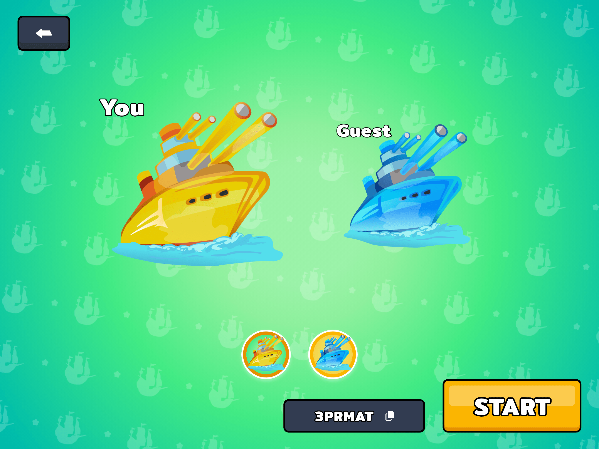

# The warship game 🛳️ ⛴️ 🚢

## Visit my [game](https://battleground-bd225.web.app/)

## Gameplay 

 
 

## How to install ⚒️

#### Clone source code

```Bash
git clone https://github.com/xuuanthuc/battleship.git
```
#### Open Warship project and run terminal

```Bash
fvm flutter pub get
fvm flutter gen-l10n
fvm flutter packages pub run build_runner build --delete-conflicting-outputs
```

Note: If you have error ```Undefined name 'AppLocalizations'.```:

-   Go to **File** -> **Invalidate Caches** -> **Invalidate and Restart**
- Run ```flutter pub get``` again

#### Config firebase project

-   Create a project in [Firebase console](https://console.firebase.google.com/) ([how to create firebase project](https://docs.appmachine.com/app-details/firebase/create-firebase-project))

-   In firebase console, Go to Project Overview and add new flutter platform

- Config flutter app according to firebase instructions

- Gen `firebase_options.dart` file

```bash
flutterfire configure --project=PROJECT_NAME
```

####  Run app


# Thank for viewing ❤️‍🔥
